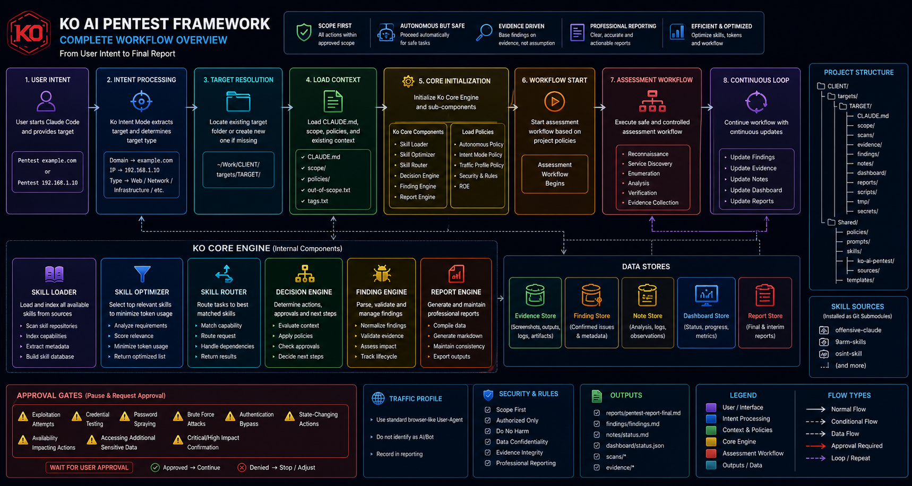
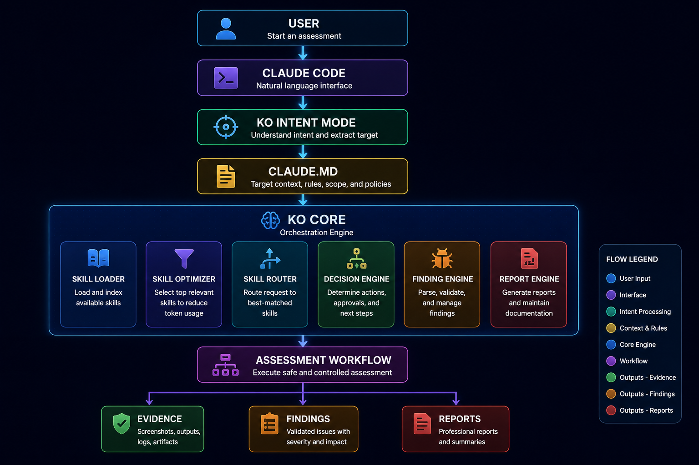
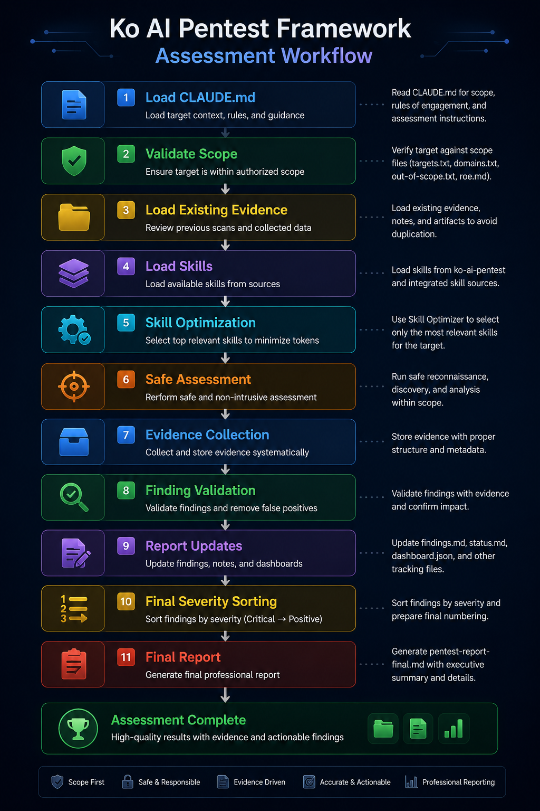

# Ko AI Pentest Framework

## Overview

Ko AI Pentest Framework is a Claude Code-driven penetration testing workspace framework designed for authorized security assessments.

The framework provides:

- Client workspace management
- Per-target isolation
- Scope enforcement
- Rules of Engagement (ROE) support
- Skill orchestration
- Evidence management
- Finding management
- Severity-based reporting
- Claude Code workflow automation
- Reusable project structure

The goal is to reduce repetitive setup work while maintaining consistent pentest methodology and reporting.

<p align="center">
  
</p>

---
---

## Table of Contents

- [Overview](#overview)
- [Vision](#vision)
- [Current Status](#current-status)
- [Architecture](#architecture)
- [Assessment Workflow](#assessment-workflow)
- [Full Workflow](#full-workflow)
- [Project Structure](#project-structure)
- [Included Skill Sources](#included-skill-sources)
- [Installation](#installation)
- [Creating Targets](#creating-targets)
- [Target Structure](#target-structure)
- [What Is CLAUDE.md](#what-is-claudemd)
- [Ko Intent Mode](#ko-intent-mode)
- [Ko Core](#ko-core)
- [Skill Optimization](#skill-optimization)
- [Autonomous Processing](#autonomous-processing)
- [BurpSuite MCP Extension Support](#burpsuite-mcp-extension-support)
- [Reporting](#reporting)
- [Finding Lifecycle](#finding-lifecycle)
- [Severity Sorting](#severity-sorting)
- [Default Traffic Profile](#default-traffic-profile)
- [Credentials](#credentials)
- [Git Submodules](#git-submodules)
- [Updating the Repository](#updating-the-repository)
- [Current Limitations](#current-limitations)
- [Roadmap](#roadmap)
- [Security Notice](#security-notice)
- [License](#license)

---
# Vision

Desired workflow:

```text
claude

Pentest example.com
```

or

```text
claude

Pentest 192.168.1.10
```

Ko should:

1. Identify the target
2. Load workspace context
3. Load target context
4. Load relevant skills
5. Review existing evidence
6. Continue assessment
7. Update findings
8. Update reporting
9. Request approval only when required

---

# Current Status

Current implementation provides:

| Component | Status |
|------------|---------|
| Workspace Management | ✅ |
| Scope Enforcement | ✅ |
| CLAUDE.md Workflow | ✅ |
| Skill Routing | ✅ |
| Skill Optimization | ✅ |
| Evidence Tracking | ✅ |
| Finding Tracking | ✅ |
| Severity Sorting | ✅ |
| Report Generation | ✅ |
| Intent Mode Policy | ✅ |
| Fully Autonomous Agent | ⚠️ Partial |
| Automatic Tool Execution | ⚠️ Partial |

---

# Architecture
<p align="center">
  
</p>
---

# Project Structure

```text
Ko-AI-Pentest/
├── README.md
├── LICENSE
├── SECURITY.md
├── install.sh
│
├── scripts/
│   ├── create-target.sh
│   └── ko-core-run.sh
│
├── ko-core/
│   ├── skill-loader.py
│   ├── skill-optimizer.py
│   ├── ko-router.py
│   ├── decision-engine.py
│   ├── finding-engine.py
│   ├── severity_engine.py
│   ├── report-engine.py
│   └── workflow-engine.py
│
├── Shared/
│   ├── prompts/
│   ├── policies/
│   ├── skills/
│   └── templates/
│
└── templates/
    └── client/
```

---

# Included Skill Sources

The framework supports integrating skill repositories through Git submodules.

Examples:

- offensive-claude
- 9arm-skills
- osint-skill

Installed under:

```text
Shared/skills/sources/
```

Unified Ko skill:

```text
Shared/skills/ko-ai-pentest/
```

---

# Installation

Clone repository:

```bash
git clone --recurse-submodules https://github.com/YOUR_USERNAME/Ko-AI-Pentest.git

cd Ko-AI-Pentest
```

Install workspace:

```bash
./install.sh CLIENT_NAME
```

Example:

```bash
./install.sh ACME
```

Workspace created:

```text
~/Desktop/AI_By_Ko/Work/ACME/
```

---

# Creating Targets

Go to workspace:

```bash
cd ~/Desktop/AI_By_Ko/Work/ACME
```

Create target:

```bash
./scripts/create-target.sh 192.168.1.10
```

Target folder created:

```text
targets/192.168.1.10/
```

---

# Target Structure

```text
targets/TARGET/
├── CLAUDE.md
├── scope/
├── scans/
├── evidence/
├── findings/
├── notes/
├── dashboard/
├── reports/
├── scripts/
├── tmp/
└── secrets/
```

---

# What Is CLAUDE.md

Each target contains a dedicated CLAUDE.md.

CLAUDE.md acts as the operating manual for Ko.

It defines:

- Scope behavior
- Rules of Engagement
- Allowed actions
- Restricted actions
- Approval gates
- Reporting requirements
- Evidence requirements
- Finding requirements
- Skill usage expectations
- Severity sorting requirements
- Autonomous workflow behavior

Every target maintains its own CLAUDE.md.

---

# Ko Intent Mode

Start Claude Code:

```bash
claude
```

Then type:

```text
Pentest 192.168.1.10
```

or

```text
Pentest example.com
```

Intent Mode should:

1. Extract target
2. Determine target type
3. Locate target folder
4. Resume existing target
5. Create target if missing
6. Load CLAUDE.md
7. Load findings
8. Load notes
9. Load reports
10. Continue assessment

---

# Ko Core

Ko Core provides orchestration and workflow support.

Components:

```text
skill-loader.py
skill-optimizer.py
ko-router.py
decision-engine.py
finding-engine.py
severity_engine.py
report-engine.py
workflow-engine.py
```

Responsibilities:

- Skill indexing
- Skill optimization
- Target classification
- Workflow routing
- Finding parsing
- Severity sorting
- Report generation

---

# Skill Optimization

To reduce token consumption:

1. Read skill index first
2. Select only relevant skills
3. Avoid loading all skill repositories
4. Reuse evidence before scanning
5. Avoid duplicate work
6. Summarize large outputs

Example:

```text
Target: Web Portal

Selected Skills:
- web-pentest
- tls-review
- auth-session-review
```

---

# Assessment Workflow
<p align="center">
  
</p>
---

# Autonomous Processing

Ko should continue automatically for routine assessment tasks.

Examples:

- Reconnaissance
- Service Discovery
- HTTP Review
- HTTPS Review
- TLS Review
- Header Review
- Cookie Review
- Version Identification
- Evidence Collection
- Report Updates

Ko should not ask approval for routine safe tasks.

---

# Approval Gates

Ko should request approval before:

- Exploitation
- Credential Testing
- Password Spraying
- Brute Force
- Authentication Bypass Validation
- State-Changing Actions
- Availability-Impacting Actions
- Accessing Additional Sensitive Data

---

# Reporting

Primary report:

```text
reports/pentest-report-final.md
```

Supporting files:

```text
findings/findings.md
notes/status.md
dashboard/status.json
```

Every meaningful action should be logged.

Recommended fields:

- Timestamp
- Command
- Action
- Reason
- Result
- Evidence Path
- Finding Relationship
- Next Step

---

# Finding Lifecycle

Each finding should include:

- Finding ID
- Original ID
- Title
- Severity
- Description
- How Discovered
- Evidence
- Impact
- Recommendation
- Validation Status

---

# Severity Sorting

Before final report generation:

```text
Critical
High
Medium
Low
Informational
Positive
```

Then assign final IDs:

```text
F-001
F-002
F-003
...
```

Original IDs should remain preserved.

---

# Default Traffic Profile

Ko should not identify itself as:

- AI
- Claude
- Bot
- Automated Agent

Use a standard browser-like User-Agent consistently.

Document User-Agent usage in reporting.

---

# Credentials

Store credentials only in:

```text
secrets/credentials.env
```

Rules:

- Never commit credentials
- Never commit secrets
- Never print plaintext secrets in reports
- Redact sensitive values

---

# Git Submodules

Initialize:

```bash
git submodule update --init --recursive
```

Update:

```bash
git submodule update --remote
```

---

# Updating the Repository

```bash
git add .

git commit -m "Update project"

git push
```

---

# Current Limitations

Current version:

- Depends on Claude Code execution
- Not a fully autonomous exploit agent
- Requires authorized scope
- Requires approval for high-risk actions
- Requires operator oversight

---

# Roadmap

Planned improvements:

- Better intent handling
- Improved skill selection
- Enhanced report generation
- Additional workflow automation
- Better target lifecycle management
- Improved evidence indexing

---

# Security Notice

This framework is intended only for authorized security assessments.

Users are responsible for ensuring they have written authorization before testing any target.

Unauthorized testing is prohibited.

---

# License

Refer to the LICENSE file for licensing information.

---

# BurpSuite MCP Extension Support

Ko supports the PortSwigger Burp Suite MCP Server BApp extension.

Default endpoint:

```text
http://127.0.0.1:9876

---

# Modes

Ko supports multiple assessment modes.

| Mode | Purpose |
|--------|----------|
| work | Client pentest |
| web | Web application pentest |
| ctf | CTF challenges |
| bugbounty | Public bug bounty |
| lab | HTB / THM / Labs |

Mode selection influences:

- Policy
- Skill selection
- Reporting
- Approval gates
---
